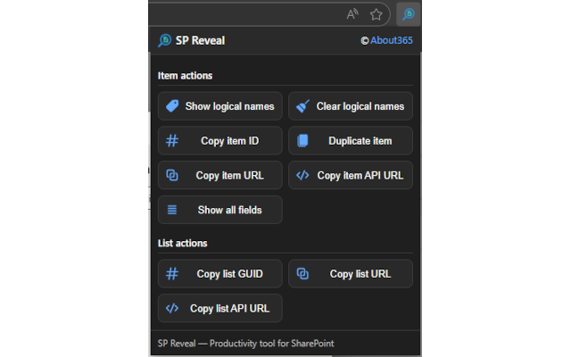
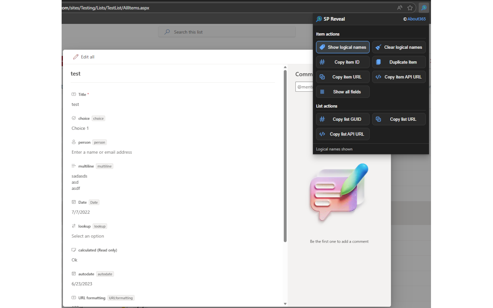
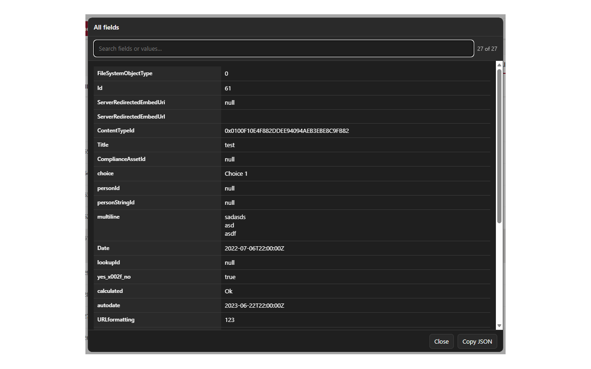

# SP Reveal — Store Listing Content (Chrome + Edge)

This file contains recommended long descriptions, short descriptions, promotional text, and permission justifications for publishing SP Reveal to the Chrome Web Store and Microsoft Edge Add-ons Store.

---

## 📝 Short Description (Chrome & Edge)

A SharePoint productivity toolkit to reveal internal names, copy URLs, duplicate items, and inspect all item fields.

(Under 132 characters — compliant with Edge & Chrome limits)

---

## 📝 Long Description (Chrome & Edge)

SP Reveal is a modern productivity extension for SharePoint Online that adds powerful developer-focused tools directly into list and item forms. Designed for SharePoint admins, developers, and power users, it makes it easier to inspect, copy, duplicate, and troubleshoot list items without leaving the page.

### 🔍 Key Features

#### **Item Tools**
- Show internal (logical) column names — now clickable to copy instantly  
- Clear internal names from the UI  
- Copy Item ID  
- Copy Item URL — correctly normalized with no double site paths  
- Copy Item API URL (`/_api/...`)  
- Duplicate an item using SharePoint REST API  
- Show All Fields — a Fluent-style dialog with search, highlighting, and full JSON export  

#### **List Tools**
- Copy list GUID  
- Copy list URL  
- Copy list API endpoint  

### ✨ Additional Highlights
- Works on modern and classic SharePoint forms  
- Detects selected items in grid view  
- Does not affect page performance  
- Themes correctly in dark/light mode  
- Fully client-side and secure  

### 🔒 Privacy & Security

SP Reveal:
- Does **not** collect or transmit data  
- Stores no SharePoint content  
- Only processes data visible to the user  
- Runs entirely in the browser  
- Never sends information to any external servers  

See full privacy policy at: `docs/privacy-policy.md`

### 🛠 Permissions

The extension requests a minimal set of permissions required for its tools:

- **activeTab** — to communicate with the current SharePoint page  
- **tabs** — to reliably detect the active tab (Chrome MV3 requirement)  
- **scripting** — to inject the content script that inspects the page  
- **storage** — stores small, local preferences  
- **clipboardWrite** — allows copying internal names, IDs, URLs  
- **Host permissions** — required to access SharePoint Online sites  

No permission is used for tracking or analytics.

### 🧑‍💻 Who Is It For?

- SharePoint administrators  
- SharePoint developers  
- Power users working with lists and libraries  
- Anyone inspecting or troubleshooting SharePoint item data  

---

## 📸 Screenshot Captions

Use these in your store listing:

1. **"Quick tools for SharePoint items — copy IDs, URLs, and API endpoints instantly."**  
   

2. **"Reveal internal (logical) column names directly on the form."**   
   

3. **"Inspect all item fields with search and JSON export."**  
   

---

## 🏷️ Promotional Text (Chrome Featured-ready)

SP Reveal adds developer-friendly tools to SharePoint list forms: reveal internal names, copy URLs and IDs, duplicate items, and inspect full field data — all directly in the browser.

---

## 🔧 Test Instructions (for store review teams)

SP Reveal requires no separate login.  
To test:

1. Sign in to any Microsoft 365 tenant with SharePoint access.
2. Open a SharePoint list.
3. Select or open an item.
4. Open the extension popup to access item and list tools.
5. Test actions such as Show Internal Names, Copy Item URL, Duplicate Item, and Show All Fields.

All features work using the user's existing SharePoint permissions.

---

## ✔ Edge Add-ons Store Link

https://microsoftedge.microsoft.com/addons/detail/sp-reveal/mpknkmeflipbbmdepeeijhojamiblfif

---

This file is ready for publication or further customization.

